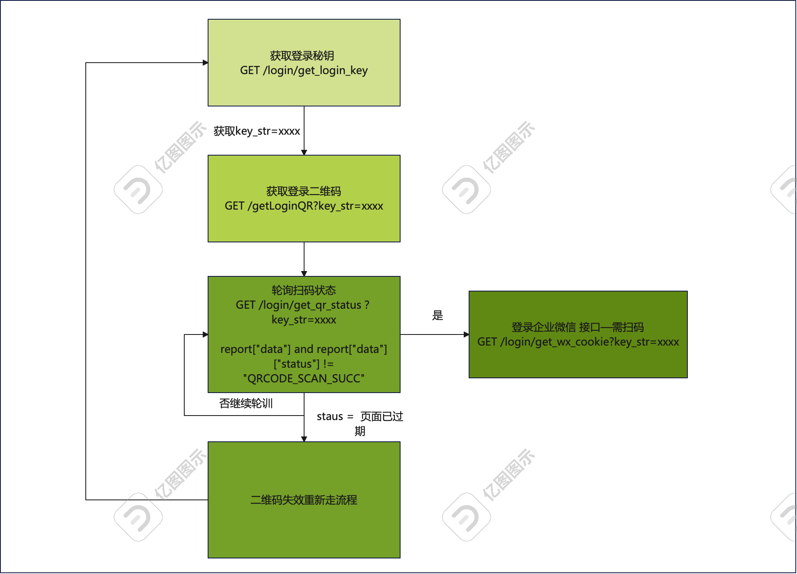

# 项目名称：企业微信后台管理 API

## 📌 项目简介

本项目为企业微信后台管理系统提供统一的 API 接口，支持登录认证、企业微信扫码登录、企业应用管理、组织架构信息查询等功能，便于企业系统与微信生态对接。

---

## 📂 接口目录

### 🔐 登录相关接口

| 方法 | 接口描述         |
|------|------------------|
| GET  | 获取登录密钥     |
| GET  | 获取登录二维码   |
| GET  | 登录企业微信（接口一需扫码） |
| GET  | 扫码状态接口     |

---

### 🏢 企业信息接口

| 方法 | 接口描述                   |
|------|----------------------------|
| GET  | 获取组织用户信息           |
| GET  | 获取组织架构信息           |

---

### 🧩 应用管理接口

| 方法 | 接口描述                   |
|------|----------------------------|
| GET  | 获取企业微信应用列表       |
| POST | 上架应用                   |
| POST | 上传应用日志               |
| GET  | 基于 app_id 获取应用详情   |
| POST | 修改 app 主页信息          |
| POST | 修改 app 配置信息          |
| POST | 删除 app                   |

---

## 📦 技术栈

- **后端框架**：Flask
- **任务调度**：flask-apscheduler
- **Redis**：用于会话或缓存处理
- **requests / requests_toolbelt**：进行第三方接口通信
- **demjson3**：处理复杂 JSON 序列化与反序列化

---

## 🛠️ 环境要求

- Python >= 3.9
- 使用 `pipreqs` 自动生成依赖项
- 执行下面命令安装依赖：
```bash

pip install -r requirements.txt

```
## 启动项目
```bash

python main.py

```

## debug
- ./conf/setting.py 中的 debug 变量设置为 True 可以开启调试模式，方便开发和测试。
- 当web页面登录企业微信后可以给 ./conf/setting.py中的cookies 变量赋值，此时调用接口时
  会自动带上cookies，避免每次都需要扫码登录。